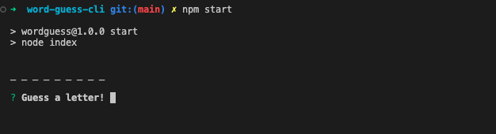
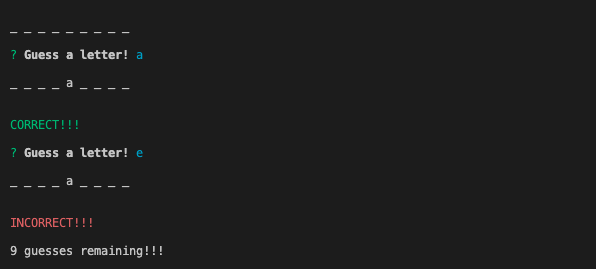
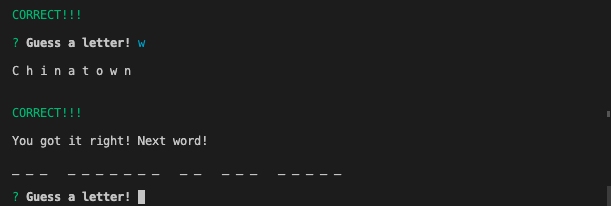
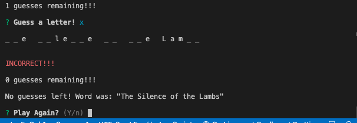

# word-guess-cli

week 11 - constructor word guess

## How to play

Open the terminal and type npm start

Use the keyboard to guess one letter, then press enter!

If you are correct, you will see an image similar to the following.

If you use all of your guesses, then you will see an image similar to the following.

If you wish to continue playing, then you can use the keyboard to input y. Then hit enter and the game will start over.
